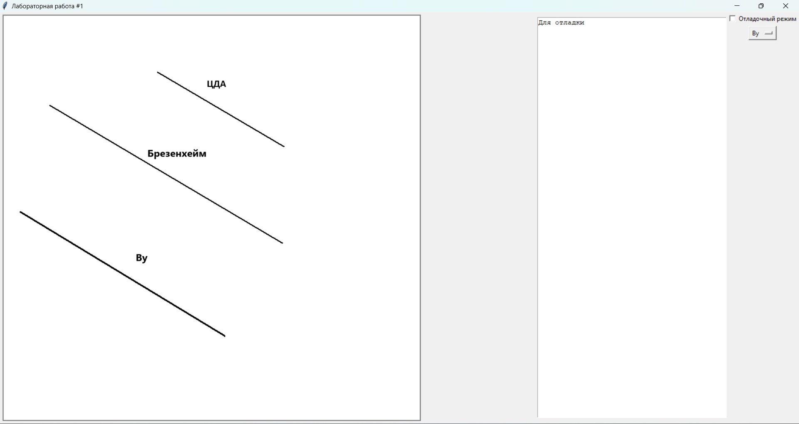

# Содержание

1. [Лабораторная работа #1 - Алгоритмы рисования линий](#lab1)
2. [Лабораторная работа #2 - ...]
3. [Лабораторная работа #3 - ...]
4. [Лабораторная работа #4 - ...]
5. [Лабораторная работа #5 - ...]
6. [Лабораторная работа #6 - ...]
7. [Лабораторная работа #7 - ...]
8. [Лабораторная работа #8 - ...]

# Лабораторная работа #1

Этот код написан на Python и использует библиотеку Tkinter для создания графического пользовательского интерфейса (GUI). Программа позволяет рисовать линии на холсте с использованием трех разных алгоритмов: ЦДА (цифровой дифференциальный анализатор), алгоритм Брезенхема и алгоритм Ву.

## Алгоритмы рисования линий

### ЦДА (Цифровой дифференциальный анализатор)

ЦДА является простым и интуитивно понятным алгоритмом для рисования линий. Он основан на уравнении прямой линии: `y = mx + b`, где `m` - угловой коэффициент, а `b` - точка пересечения с осью Y. Алгоритм использует концепцию разбиения линии на равные шаги и определения координат точек на основе инкрементов по осям X и Y.

Шаги алгоритма ЦДА:

1. Вычислить приращения `dx` и `dy` между начальной и конечной точками линии.
2. Определить количество шагов как максимум из `abs(dx)` и `abs(dy)`.
3. Вычислить инкременты `x_increment` и `y_increment`, разделив `dx` и `dy` на количество шагов соответственно.
4. Начиная с начальной точки, на каждом шаге увеличивать координаты `x` и `y` на соответствующие инкременты и рисовать точку на этих координатах.

Алгоритм ЦДА хорошо работает для линий с небольшими углами наклона, но может давать ступенчатый результат для линий с большими углами наклона.

### Алгоритм Брезенхема

Алгоритм Брезенхема является одним из наиболее широко используемых алгоритмов для рисования линий. Он использует целочисленную арифметику и принцип инкрементов для определения следующей точки на линии, что делает его более эффективным и точным, чем ЦДА.

Шаги алгоритма Брезенхема:

1. Вычислить приращения `dx` и `dy` между начальной и конечной точками линии.
2. Определить направление рисования линии (слева направо или справа налево) на основе знаков `dx` и `dy`.
3. Инициализировать переменную ошибки `err` как `dx - dy`.
4. На каждом шаге:
   - Нарисовать текущую точку.
   - Обновить переменную ошибки `err` в зависимости от знака `e2 = 2 * err`.
   - Если `e2 > -dy`, добавить `dy` к `err` и переместиться по оси X.
   - Если `e2 < dx`, добавить `dx` к `err` и переместиться по оси Y.

Алгоритм Брезенхема обеспечивает более гладкие линии по сравнению с ЦДА и работает хорошо для линий с любыми углами наклона.

### Алгоритм Ву

Алгоритм Ву является усовершенствованным алгоритмом для рисования линий, который использует концепцию интенсивности пикселей для получения более гладких линий. Он рассчитывает интенсивность пикселей вдоль линии на основе их расстояния от истинной линии и затем отображает пиксели с соответствующей интенсивностью.

Шаги алгоритма Ву:

1. Вычислить приращения `dx` и `dy` между начальной и конечной точками линии.
2. Если `dx > dy`, рассматривать линию как горизонтальную, в противном случае - как вертикальную.
3. Для горизонтальной линии:
   - Вычислить градиент `gradient = dy / dx`.
   - Для каждой целочисленной координаты `x` между `x0` и `x1`:
     - Вычислить `y` как `y0 + gradient * (x - x0)`.
     - Нарисовать два пикселя с координатами `(x, floor(y))` и `(x, ceil(y))` с интенсивностями, пропорциональными расстоянию до истинной линии.
4. Для вертикальной линии:
   - Вычислить градиент `gradient = dx / dy`.
   - Для каждой целочисленной координаты `y` между `y0` и `y1`:
     - Вычислить `x` как `x0 + gradient * (y - y0)`.
     - Нарисовать два пикселя с координатами `(floor(x), y)` и `(ceil(x), y)` с интенсивностями, пропорциональными расстоянию до истинной линии.

Алгоритм Ву обеспечивает высококачественное рисование линий, но требует больших вычислительных ресурсов по сравнению с другими алгоритмами.

## Структура кода

- Класс `Lab1` наследуется от `tk.Tk` и содержит методы и функции для создания и управления GUI.
- В конструкторе `__init__` инициализируются все необходимые компоненты GUI: холст, панель инструментов, флажок для отладочного режима, меню выбора алгоритма и текстовая область для вывода отладочной информации.
- Методы `start_draw`, `draw` и `end_draw` обрабатывают события мыши для рисования линии.
- Метод `draw_line` определяет, какой алгоритм использовать для рисования линии, и вызывает соответствующий метод: `draw_dda`, `draw_bresenham` или `draw_wu`.
- Методы `draw_dda`, `draw_bresenham` и `draw_wu` реализуют соответствующие алгоритмы для рисования линии на холсте.

## Использование программы

1. Запустите скрипт в Python.
2. В открывшемся окне выберите алгоритм для рисования линии из выпадающего меню.
3. Если необходимо, включите отладочный режим, установив флажок "Отладочный режим".
4. Нажмите левую кнопку мыши и удерживайте ее, чтобы начать рисование линии.
5. Переместите курсор мыши, чтобы изменить конечную точку линии.
6. Отпустите левую кнопку мыши, чтобы завершить рисование линии.
7. В отладочном режиме координаты точек линии будут выводиться в текстовой области.

## Зависимости

Этот код использует только стандартную библиотеку Python `tkinter`.
