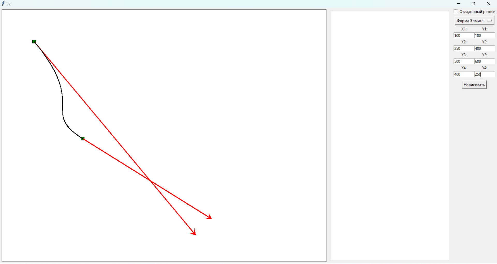

# Содержание

1. [Лабораторная работа #1 - Алгоритмы рисования линий](#lab1)
2. [Лабораторная работа #2 - Рисование кривых второго порядка](#lab2)
3. [Лабораторная работа #3 - Построение кривых Безье, Эрмита и B-сплайнов](#lab3)
4. [Лабораторная работа #4 - Геометрические преобразования в трехмерном пространстве](#lab4)
5. [Лабораторная работа #5 - Построение выпуклой оболочки](#lab5)
6. [Лабораторная работа #6 - ...]
7. [Лабораторная работа #7 - ...]
8. [Лабораторная работа #8 - ...]

# Лабораторная работа #1 - Алгоритмы рисования линий

Этот код написан на Python и использует библиотеку Tkinter для создания графического пользовательского интерфейса (GUI). Программа позволяет рисовать линии на холсте с использованием трех разных алгоритмов: ЦДА (цифровой дифференциальный анализатор), алгоритм Брезенхема и алгоритм Ву.

## Алгоритмы рисования линий

### ЦДА (Цифровой дифференциальный анализатор)

ЦДА является простым и интуитивно понятным алгоритмом для рисования линий. Он основан на уравнении прямой линии: `y = mx + b`, где `m` - угловой коэффициент, а `b` - точка пересечения с осью Y. Алгоритм использует концепцию разбиения линии на равные шаги и определения координат точек на основе инкрементов по осям X и Y.

Шаги алгоритма ЦДА:

1. Вычислить приращения `dx` и `dy` между начальной и конечной точками линии.
2. Определить количество шагов как максимум из `abs(dx)` и `abs(dy)`.
3. Вычислить инкременты `x_increment` и `y_increment`, разделив `dx` и `dy` на количество шагов соответственно.
4. Начиная с начальной точки, на каждом шаге увеличивать координаты `x` и `y` на соответствующие инкременты и рисовать точку на этих координатах.

Алгоритм ЦДА хорошо работает для линий с небольшими углами наклона, но может давать ступенчатый результат для линий с большими углами наклона.

### Алгоритм Брезенхема

Алгоритм Брезенхема является одним из наиболее широко используемых алгоритмов для рисования линий. Он использует целочисленную арифметику и принцип инкрементов для определения следующей точки на линии, что делает его более эффективным и точным, чем ЦДА.

Шаги алгоритма Брезенхема:

1. Вычислить приращения `dx` и `dy` между начальной и конечной точками линии.
2. Определить направление рисования линии (слева направо или справа налево) на основе знаков `dx` и `dy`.
3. Инициализировать переменную ошибки `err` как `dx - dy`.
4. На каждом шаге:
   - Нарисовать текущую точку.
   - Обновить переменную ошибки `err` в зависимости от знака `e2 = 2 * err`.
   - Если `e2 > -dy`, добавить `dy` к `err` и переместиться по оси X.
   - Если `e2 < dx`, добавить `dx` к `err` и переместиться по оси Y.

Алгоритм Брезенхема обеспечивает более гладкие линии по сравнению с ЦДА и работает хорошо для линий с любыми углами наклона.

### Алгоритм Ву

Алгоритм Ву является усовершенствованным алгоритмом для рисования линий, который использует концепцию интенсивности пикселей для получения более гладких линий. Он рассчитывает интенсивность пикселей вдоль линии на основе их расстояния от истинной линии и затем отображает пиксели с соответствующей интенсивностью.

Шаги алгоритма Ву:

1. Вычислить приращения `dx` и `dy` между начальной и конечной точками линии.
2. Если `dx > dy`, рассматривать линию как горизонтальную, в противном случае - как вертикальную.
3. Для горизонтальной линии:
   - Вычислить градиент `gradient = dy / dx`.
   - Для каждой целочисленной координаты `x` между `x0` и `x1`:
     - Вычислить `y` как `y0 + gradient * (x - x0)`.
     - Нарисовать два пикселя с координатами `(x, floor(y))` и `(x, ceil(y))` с интенсивностями, пропорциональными расстоянию до истинной линии.
4. Для вертикальной линии:
   - Вычислить градиент `gradient = dx / dy`.
   - Для каждой целочисленной координаты `y` между `y0` и `y1`:
     - Вычислить `x` как `x0 + gradient * (y - y0)`.
     - Нарисовать два пикселя с координатами `(floor(x), y)` и `(ceil(x), y)` с интенсивностями, пропорциональными расстоянию до истинной линии.

Алгоритм Ву обеспечивает высококачественное рисование линий, но требует больших вычислительных ресурсов по сравнению с другими алгоритмами.

## Структура кода

- Класс `Lab1` наследуется от `tk.Tk` и содержит методы и функции для создания и управления GUI.
- В конструкторе `__init__` инициализируются все необходимые компоненты GUI: холст, панель инструментов, флажок для отладочного режима, меню выбора алгоритма и текстовая область для вывода отладочной информации.
- Методы `start_draw`, `draw` и `end_draw` обрабатывают события мыши для рисования линии.
- Метод `draw_line` определяет, какой алгоритм использовать для рисования линии, и вызывает соответствующий метод: `draw_dda`, `draw_bresenham` или `draw_wu`.
- Методы `draw_dda`, `draw_bresenham` и `draw_wu` реализуют соответствующие алгоритмы для рисования линии на холсте.

## Реализация

## Использование программы

1. Запустите скрипт в Python.
2. В открывшемся окне выберите алгоритм для рисования линии из выпадающего меню.
3. Если необходимо, включите отладочный режим, установив флажок "Отладочный режим".
4. Нажмите левую кнопку мыши и удерживайте ее, чтобы начать рисование линии.
5. Переместите курсор мыши, чтобы изменить конечную точку линии.
6. Отпустите левую кнопку мыши, чтобы завершить рисование линии.
7. В отладочном режиме координаты точек линии будут выводиться в текстовой области.

## Зависимости

Этот код использует только стандартную библиотеку Python `tkinter`.

# Лабораторная работа #2 - Рисование кривых второго порядка

Этот код написан на Python с использованием библиотек Tkinter и NumPy. Программа позволяет рисовать кривые второго порядка (окружность, эллипс, гиперболу и параболу) на холсте.

## Функциональность

- Выбор типа кривой из выпадающего меню: окружность, эллипс, гипербола или парабола.
- Ввод параметров кривой (радиус/полуоси/коэффициент) через поля ввода.
- Рисование выбранной кривой на холсте.
- Возможность включения отладочного режима для вывода координат точек кривой.

## Алгоритмы рисования кривых

### Окружность и эллипс

Для построения окружности и эллипса используется параметрическое уравнение:

$$
x = h + a \cdot \cos(t) \\
y = k + b \cdot \sin(t)
$$

где `a` и `b` - длины полуосей, `h` и `k` - координаты центра, а `t` принимает значения от 0 до 2π.

### Парабола

Для построения параболы используется уравнение:

$$
y = ax^2
$$

где `a` - коэффициент параболы.

### Гипербола

Для построения гиперболы используется уравнение:

$$
\frac{{(x - h)^2}}{{a^2}} - \frac{{(y - k)^2}}{{b^2}} = 1
$$

где `a` и `b` - длины полуосей, `h` и `k` - координаты центра.

## Структура кода

- Класс `Lab2` наследуется от `tk.Tk` и содержит методы и функции для создания и управления GUI.
- В конструкторе `__init__` инициализируются все необходимые компоненты GUI: холст, панель инструментов, поля ввода, кнопка для рисования и текстовая область для вывода отладочной информации.
- Метод `draw_conic` обрабатывает нажатие кнопки "Нарисовать" и вызывает соответствующий метод для построения выбранной кривой.
- Методы `get_ellipse_points`, `get_parabola_points` и `get_hyperbola_points` вычисляют координаты точек для соответствующих кривых.
- Методы `draw`, `draw_debug`, `draw_default` и `draw_hype` отвечают за отрисовку кривых на холсте, включая отладочный режим.
- Метод `clear_canvas` очищает холст перед рисованием новой кривой.

## Реализация

## Использование программы

1. Запустите скрипт в Python.
2. В открывшемся окне выберите тип кривой из выпадающего меню.
3. Введите необходимые параметры (радиус, полуоси или коэффициент) в соответствующие поля ввода.
4. Нажмите кнопку "Нарисовать" для построения выбранной кривой на холсте.
5. Если необходимо, включите отладочный режим, установив флажок "Отладочный режим" для вывода координат точек кривой в текстовую область.

## Зависимости

Этот код использует следующие библиотеки Python:

- `tkinter` - для создания графического пользовательского интерфейса.
- `numpy` - для вычислительных операций, используемых при построении кривых.

# Лабораторная работа #3 - Построение кривых Безье, Эрмита и B-сплайнов

Этот код написан на Python с использованием библиотеки Tkinter. Программа позволяет строить кривые Безье, кривые Эрмита и B-сплайны, задавая координаты контрольных точек.

## Функциональность

- Выбор типа кривой из выпадающего меню: кривая Безье, кривая Эрмита или B-сплайн.
- Ввод координат контрольных точек для построения кривой через поля ввода.
- Рисование выбранной кривой на холсте.
- Возможность включения отладочного режима для вывода координат точек кривой.

## Алгоритмы построения кривых

### Кривая Безье

Кривая Безье задается четырьмя контрольными точками `(x1, y1)`, `(x2, y2)`, `(x3, y3)` и `(x4, y4)`. Уравнение кривой Безье имеет вид:

$$
x(t) = (1 - t)^3 \cdot x_1 + 3t(1 - t)^2 \cdot x_2 + 3t^2(1 - t) \cdot x_3 + t^3 \cdot x_4
$$

$$
y(t) = (1 - t)^3 \cdot y_1 + 3t(1 - t)^2 \cdot y_2 + 3t^2(1 - t) \cdot y_3 + t^3 \cdot y_4
$$

где `t` изменяется от 0 до 1.

### Кривая Эрмита

Кривая Эрмита также задается четырьмя контрольными точками `(x1, y1)`, `(x2, y2)`, `(x3, y3)` и `(x4, y4)`, где `(x3, y3)` и `(x4, y4)` представляют касательные векторы в начальной и конечной точках соответственно. Уравнение кривой Эрмита имеет вид:

$$
x(t) = x_1 + x_3t + (-3x_1 + 3x_2 - 2x_3 - x_4)t^2 + (2x_1 - 2x_2 + x_3 + x_4)t^3
$$

$$
y(t) = y_1 + y_3t + (-3y_1 + 3y_2 - 2y_3 - y_4)t^2 + (2y_1 - 2y_2 + y_3 + y_4)t^3
$$

где `t` изменяется от 0 до 1.

### B-сплайн

B-сплайн строится на основе четырех контрольных точек `(x1, y1)`, `(x2, y2)`, `(x3, y3)` и `(x4, y4)`. Уравнение B-сплайна имеет вид:

$$
x(t) = (1 - t)^3 \cdot x_{1_{\text{new}}} + 3t(1 - t)^2 \cdot x_{2_{\text{new}}} + 3t^2(1 - t) \cdot x_{3_{\text{new}}} + t^3 \cdot x_{4_{\text{new}}}
$$

$$
y(t) = (1 - t)^3 \cdot y_{1_{\text{new}}} + 3t(1 - t)^2 \cdot y_{2_{\text{new}}} + 3t^2(1 - t) \cdot y_{3_{\text{new}}} + t^3 \cdot y_{4_{\text{new}}}
$$

где `t` изменяется от 0 до 1, а `(x1_new, y1_new)`, `(x2_new, y2_new)`, `(x3_new, y3_new)` и `(x4_new, y4_new)` являются вспомогательными точками, вычисляемыми на основе контрольных точек.

## Структура кода

- Класс `Lab3` наследуется от `tk.Tk` и содержит методы и функции для создания и управления GUI.
- В конструкторе `__init__` инициализируются все необходимые компоненты GUI: холст, панель инструментов, поля ввода, кнопка для рисования и текстовая область для вывода отладочной информации.
- Метод `drawer` обрабатывает нажатие кнопки "Нарисовать" и вызывает соответствующий метод для построения выбранной кривой.
- Методы `create_bezie`, `create_ermit` и `create_B_spline` реализуют алгоритмы построения соответствующих кривых на основе введенных контрольных точек.
- Метод `draw_utility` отвечает за отрисовку точек на холсте.
- Метод `clear_canvas` очищает холст перед рисованием новой кривой.

## Реализация

## Использование программы

1. Запустите скрипт в Python.
2. В открывшемся окне выберите тип кривой из выпадающего меню.
3. Введите координаты контрольных точек в соответствующие поля ввода.
4. Нажмите кнопку "Нарисовать" для построения выбранной кривой на холсте.
5. Если необходимо, включите отладочный режим, установив флажок "Отладочный режим" для вывода координат точек кривой в текстовую область.

## Зависимости

Этот код использует только стандартную библиотеку Python `tkinter`.

# Лабораторная работа #4 - Геометрические преобразования в трехмерном пространстве

## Описание

Этот код написан на Python с использованием библиотеки tkinter для создания графического пользовательского интерфейса (GUI) и библиотеки matplotlib для визуализации данных в 3D. Программа создает окно с возможностью ввода количества вокселей и отображает куб из вокселей.

## Структура кода

- Класс `Lab4` наследуется от `tk.Tk` и содержит методы и функции для создания и управления GUI.
- В конструкторе `__init__` инициализируются все необходимые компоненты GUI: метка для ввода количества вокселей, поле ввода, кнопка для подтверждения ввода.
- Метод `set_changes` вызывается при нажатии кнопки "Ввод" и создает 3D график с заданным количеством вокселей, используя библиотеку matplotlib.

## Реализация

## Использование программы

1. Запустите скрипт в Python.
2. В открывшемся окне введите желаемое количество вокселей.
3. Нажмите кнопку "Ввод".
4. После этого на экране появится визуализация куба из вокселей.

## Зависимости

Этот код использует следующие библиотеки:

- `numpy`
- `matplotlib`
- `tkinter`

Убедитесь, что у вас установлены эти библиотеки для корректной работы программы.

# Лабораторная работа #5 - Построение выпуклой оболочки

Этот код написан на Python с использованием библиотеки Tkinter. Программа позволяет строить выпуклую оболочку для заданного множества точек на плоскости, используя алгоритмы Джарвиса и Грэхема.

## Функциональность

- Выбор алгоритма построения выпуклой оболочки из выпадающего меню: алгоритм Джарвиса или алгоритм Грэхема.
- Ввод координат точек для построения выпуклой оболочки через поля ввода или загрузка из файла.
- Рисование исходных точек и выпуклой оболочки на холсте.
- Возможность включения отладочного режима для вывода точек выпуклой оболочки.

## Алгоритмы построения выпуклой оболочки

### Алгоритм Джарвиса

Алгоритм Джарвиса, также известный как алгоритм обхода, строит выпуклую оболочку на основе следующих шагов:

1. Выбрать начальную точку, например, самую нижнюю точку.
2. Отсортировать остальные точки по полярному углу относительно начальной точки.
3. Начать движение по точкам в порядке сортировки, на каждом шаге выбирая точку, которая максимально удалена от текущего направления.
4. Продолжать движение до тех пор, пока не вернемся к начальной точке.

### Алгоритм Грэхема

Алгоритм Грэхема строит выпуклую оболочку на основе следующих шагов:

1. Выбрать точку с минимальной координатой `y`, а при равенстве `y` - с минимальной координатой `x` (эта точка будет лежать на оболочке).
2. Отсортировать остальные точки по полярному углу относительно выбранной точки.
3. Добавить первые две точки из отсортированного списка в стек.
4. Для каждой следующей точки:
   - Пока вектор, образованный верхушкой стека и новой точкой, поворачивает не по часовой стрелке, удалять верхушку стека.
   - Добавить новую точку в стек.
5. Извлечь все точки из стека, они и будут точками выпуклой оболочки.

## Структура кода

- Класс `Lab5` наследуется от `tk.Tk` и содержит методы и функции для создания и управления GUI.
- В конструкторе `__init__` инициализируются все необходимые компоненты GUI: холст, панель инструментов, поля ввода, кнопка для загрузки файла с точками и текстовая область для вывода отладочной информации.
- Метод `open_file` позволяет загрузить точки из файла.
- Метод `drawer` обрабатывает нажатие кнопки "Нарисовать" и вызывает соответствующий метод для построения выпуклой оболочки.
- Методы `graham_handler`, `draw_gram`, `jarvis_handler` и `draw_jarvis` реализуют алгоритмы построения выпуклой оболочки по методу Грэхема и Джарвиса соответственно.
- Методы `draw_utility` и `draw_segment` отвечают за отрисовку точек и отрезков на холсте.
- Метод `clear_canvas` очищает холст перед рисованием новой выпуклой оболочки.

## Реализация

## Использование программы

1. Запустите скрипт в Python.
2. В открывшемся окне выберите алгоритм построения выпуклой оболочки из выпадающего меню.
3. Нажмите кнопку "Выбрать файл" для загрузки точек из файла.
4. В случае необходимости вы можете отредактировать точки в появившихся текстовых полях.
5. Нажмите кнопку "Нарисовать" для построения выпуклой оболочки на холсте.
6. Если необходимо, включите отладочный режим, установив флажок "Отладочный режим" для вывода точек выпуклой оболочки в текстовую область.

## Зависимости

Этот код использует только стандартную библиотеку Python `tkinter`.
